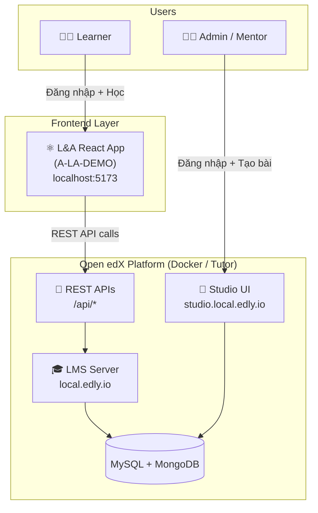

# 🚀 Open edX Integration — Execution Plan

> **Project**: A-LA-DEMO (L&A Onboarding LMS)  
> **Mục tiêu**: Tích hợp Open edX làm Backend cho FE hiện tại  
> **Nguyên tắc**: Learner dùng FE custom (React), Admin/Mentor dùng Studio UI (Open edX built-in)  
> **Created**: 2026-04-21

---

## 📐 Kiến trúc tổng thể



### Phân quyền đăng nhập

| Role | Sau khi login → | UI | Chức năng |
|------|----------------|-----|-----------|
| **Learner** | Redirect → `localhost:5173/dashboard` | FE React (A-LA-DEMO) | Xem khóa học, học bài, làm quiz, xem progress |
| **Admin/Mentor** | Redirect → `studio.local.edly.io` | Studio UI (Open edX built-in) | Tạo khóa học, thêm video/quiz/slide, quản lý learner |

> [!TIP]
> **CÓ, hoàn toàn dùng được Studio UI của Open edX cho Admin/Mentor.**  
> Studio là giao diện WYSIWYG chuyên nghiệp, cho phép tạo course, thêm video, quiz, HTML content mà không cần code. Không cần build UI riêng cho admin.

---

## 📋 Execution Phases

| Phase | Nội dung | Thời gian | Status |
|-------|----------|-----------|--------|
| **Phase 0** | Cài đặt môi trường (WSL2 + Docker + Tutor) | 1 ngày | ⬜ |
| **Phase 1** | Setup Open edX + OAuth2 + CORS | 0.5 ngày | ⬜ |
| **Phase 2** | Authentication + Role-based routing | 1-2 ngày | ⬜ |
| **Phase 3** | User Profile + Dashboard APIs | 1 ngày | ⬜ |
| **Phase 4** | Course List + Enrollment + Course Structure | 2 ngày | ⬜ |
| **Phase 5** | Lesson Content (Video/Quiz/Slide) + Progress | 2-3 ngày | ⬜ |
| **Phase 6** | Polish, Error handling, Custom features | 1-2 ngày | ⬜ |

---

## Phase 0: Cài đặt môi trường

### Step 0.1 — Cài WSL2

Mở **PowerShell as Administrator**:

```powershell
# Bật WSL
wsl --install

# Restart máy sau khi cài xong
# Sau khi restart, Ubuntu sẽ tự mở và yêu cầu tạo username/password
```

> [!IMPORTANT]
> Sau khi restart, mở Ubuntu terminal và tạo username/password Linux. Ghi nhớ password này.

### Step 0.2 — Cài Docker Desktop

1. Download: https://www.docker.com/products/docker-desktop/
2. Cài đặt, chọn **"Use WSL 2 based engine"**
3. Sau cài xong, mở Docker Desktop → **Settings**:
   - ✅ General → "Use WSL 2 based engine" 
   - ✅ Resources → WSL Integration → Enable cho Ubuntu
   - ✅ Resources → Memory: **tối thiểu 6GB** (recommend 8GB)
4. Apply & Restart

### Step 0.3 — Verify Docker trong WSL

Mở **Ubuntu terminal** (Windows Terminal → Ubuntu):

```bash
# Kiểm tra Docker hoạt động
docker --version
docker compose version

# Test
docker run hello-world
```

### Step 0.4 — Cài Tutor

```bash
# Cài Python pip (nếu chưa có)
sudo apt update && sudo apt install python3-pip python3-venv -y

# Cài Tutor
pip install "tutor[full]"

# Thêm vào PATH (nếu cần)
echo 'export PATH="$HOME/.local/bin:$PATH"' >> ~/.bashrc
source ~/.bashrc

# Verify
tutor --version
```

> [!NOTE]
> **Checkpoint Phase 0**: Chạy `tutor --version` thành công → Tiếp Phase 1

---

## Phase 1: Setup Open edX + OAuth2 + CORS

### Step 1.1 — Launch Open edX

```bash
# Khởi chạy Open edX (lần đầu mất 15-30 phút)
tutor local launch
```

**Khi được hỏi, nhập:**

| Prompt | Giá trị |
|--------|---------|
| LMS host | `local.edly.io` (default) |
| CMS host | `studio.local.edly.io` (default) |
| Platform name | `L&A E-learning` |
| Admin email | `admin@la.vn` |
| Admin username | `admin` |

Tutor sẽ tự động:
- Pull Docker images
- Tạo databases (MySQL + MongoDB)
- Tạo admin superuser
- Start tất cả services

### Step 1.2 — Verify Open edX hoạt động

```bash
# Kiểm tra containers đang chạy
tutor local status

# Mở trình duyệt:
# LMS:    http://local.edly.io
# Studio: http://studio.local.edly.io
# Admin:  http://local.edly.io/admin/
```

> [!WARNING]
> Nếu `local.edly.io` không resolve, thêm vào file hosts:
> ```
> # File: C:\Windows\System32\drivers\etc\hosts
> 127.0.0.1 local.edly.io
> 127.0.0.1 studio.local.edly.io
> ```

### Step 1.3 — Tạo OAuth2 Application

```bash
# Tạo OAuth2 app cho FE React
tutor local run lms python manage.py lms create_dot_application \
  --grant-type password \
  --redirect-uri "http://localhost:5173/auth/callback" \
  --client-id "la-elearning-fe" \
  --client-secret "la-elearning-secret-2026" \
  --skip-authorization \
  "LA-Elearning-Frontend" admin
```

**Ghi lại thông tin:**
```
CLIENT_ID     = la-elearning-fe
CLIENT_SECRET = la-elearning-secret-2026
```

### Step 1.4 — Enable cần thiết

```bash
# Bật completion tracking (theo dõi progress)
tutor local run lms python manage.py lms waffle_switch \
  --create completion.enable_completion_tracking --enable

# Bật notifications
tutor local run lms python manage.py lms waffle_switch \
  --create notifications.enable_notifications --enable
```

### Step 1.5 — Cấu hình CORS

```bash
# Cho phép FE gọi API
tutor config save --set 'OPENEDX_EXTRA_PIP_REQUIREMENTS=["django-cors-headers"]'

# Set CORS origins
tutor config save --append 'LMS_EXTRA_SETTINGS' \
  "CORS_ORIGIN_WHITELIST = ['http://localhost:5173', 'http://127.0.0.1:5173']"
tutor config save --append 'LMS_EXTRA_SETTINGS' \
  "CORS_ALLOW_CREDENTIALS = True"

# Rebuild và restart
tutor local restart
```

**Backup plan — Vite proxy (nếu CORS vẫn lỗi):**

Thêm vào `vite.config.ts`:
```typescript
server: {
  proxy: {
    '/api': { target: 'http://local.edly.io', changeOrigin: true },
    '/oauth2': { target: 'http://local.edly.io', changeOrigin: true },
  }
}
```

### Step 1.6 — Tạo test users

```bash
# Tạo learner account
tutor local run lms python manage.py lms manage_user learner1 learner1@la.vn \
  --initial-password "Learner@123"

# Tạo mentor/staff account  
tutor local run lms python manage.py lms manage_user mentor1 mentor1@la.vn \
  --initial-password "Mentor@123" --staff
```

### Step 1.7 — Test API thủ công

```bash
# Test lấy token
curl -X POST http://local.edly.io/oauth2/access_token \
  -d "grant_type=password" \
  -d "client_id=la-elearning-fe" \
  -d "client_secret=la-elearning-secret-2026" \
  -d "username=learner1" \
  -d "password=Learner@123"

# Response mong đợi:
# {"access_token":"eyJ...", "token_type":"JWT", "expires_in":36000, "scope":"..."}

# Test lấy user info (thay <TOKEN> bằng access_token ở trên)
curl -H "Authorization: JWT <TOKEN>" http://local.edly.io/api/user/v1/me
```

> [!NOTE]
> **Checkpoint Phase 1**: Lấy được JWT token + user info qua curl → Tiếp Phase 2

---

## Phase 2: Authentication + Role-based Routing

### Mục tiêu
- Login thật qua Open edX OAuth2
- Phân biệt Learner vs Admin/Mentor sau khi login
- Learner → FE React, Admin → redirect Studio

### Step 2.1 — Cài thêm dependencies

```bash
cd d:\A-LA-DEMO
npm install axios
```

### Step 2.2 — Tạo config

**File: `src/config/env.ts`**

```typescript
export const config = {
  // Open edX endpoints
  lmsBaseUrl: import.meta.env.VITE_OPENEDX_LMS_URL || 'http://local.edly.io',
  studioBaseUrl: import.meta.env.VITE_OPENEDX_CMS_URL || 'http://studio.local.edly.io',
  
  // OAuth2 credentials
  clientId: import.meta.env.VITE_OPENEDX_CLIENT_ID || 'la-elearning-fe',
  clientSecret: import.meta.env.VITE_OPENEDX_CLIENT_SECRET || 'la-elearning-secret-2026',
} as const;
```

**File: `.env.local`**

```env
VITE_OPENEDX_LMS_URL=http://local.edly.io
VITE_OPENEDX_CMS_URL=http://studio.local.edly.io
VITE_OPENEDX_CLIENT_ID=la-elearning-fe
VITE_OPENEDX_CLIENT_SECRET=la-elearning-secret-2026
```

### Step 2.3 — Tạo API client

**File: `src/api/client.ts`**

```typescript
import axios from 'axios';
import { config } from '@/config/env';
import { useAuthStore } from '@/stores/useAuthStore';

export const apiClient = axios.create({
  baseURL: config.lmsBaseUrl,
  headers: { 'Content-Type': 'application/json' },
  withCredentials: true,
});

// Request interceptor — attach JWT token
apiClient.interceptors.request.use((req) => {
  const token = useAuthStore.getState().accessToken;
  if (token) {
    req.headers.Authorization = `JWT ${token}`;
  }
  return req;
});

// Response interceptor — handle 401
apiClient.interceptors.response.use(
  (res) => res,
  async (error) => {
    if (error.response?.status === 401) {
      useAuthStore.getState().logout();
      window.location.href = '/login';
    }
    return Promise.reject(error);
  }
);
```

### Step 2.4 — Tạo Auth API

**File: `src/api/auth.ts`**

```typescript
import axios from 'axios';
import { config } from '@/config/env';
import { apiClient } from './client';

export interface LoginResponse {
  access_token: string;
  token_type: string;
  expires_in: number;
  scope: string;
}

export interface UserMe {
  username: string;
  email: string;
  is_staff: boolean;  // ← Đây là key phân quyền
}

export interface UserAccount {
  username: string;
  name: string;
  email: string;
  date_joined: string;
  profile_image: {
    image_url_medium: string;
    image_url_small: string;
    has_image: boolean;
  };
  level_of_education: string | null;
  bio: string | null;
}

// Login → lấy JWT token
export async function loginApi(username: string, password: string): Promise<LoginResponse> {
  const { data } = await axios.post(
    `${config.lmsBaseUrl}/oauth2/access_token`,
    new URLSearchParams({
      grant_type: 'password',
      client_id: config.clientId,
      client_secret: config.clientSecret,
      username,
      password,
    }),
    { headers: { 'Content-Type': 'application/x-www-form-urlencoded' } }
  );
  return data;
}

// Lấy user cơ bản (có is_staff)
export async function getUserMe(): Promise<UserMe> {
  const { data } = await apiClient.get('/api/user/v1/me');
  return data;
}

// Lấy user chi tiết
export async function getUserAccount(username: string): Promise<UserAccount> {
  const { data } = await apiClient.get(`/api/user/v1/accounts/${username}`);
  return data;
}
```

### Step 2.5 — Update Auth Store

**File: `src/stores/useAuthStore.ts`** (rewrite)

```typescript
import { create } from 'zustand';
import { persist } from 'zustand/middleware';
import { loginApi, getUserMe, getUserAccount } from '@/api/auth';
import type { UserAccount } from '@/api/auth';

interface AuthState {
  // State
  isAuthenticated: boolean;
  accessToken: string | null;
  user: {
    username: string;
    email: string;
    name: string;
    avatar: string | null;
    dateJoined: string;
    isStaff: boolean;       // ← Phân quyền: true = Admin/Mentor
  } | null;
  
  // Actions
  login: (username: string, password: string) => Promise<'learner' | 'staff'>;
  logout: () => void;
}

export const useAuthStore = create<AuthState>()(
  persist(
    (set, get) => ({
      isAuthenticated: false,
      accessToken: null,
      user: null,

      login: async (username: string, password: string) => {
        // 1. Lấy JWT token
        const tokenRes = await loginApi(username, password);
        set({ accessToken: tokenRes.access_token });
        
        // 2. Lấy user info
        const me = await getUserMe();
        const account = await getUserAccount(me.username);
        
        // 3. Store user
        set({
          isAuthenticated: true,
          user: {
            username: me.username,
            email: me.email,
            name: account.name,
            avatar: account.profile_image?.has_image 
              ? account.profile_image.image_url_medium 
              : null,
            dateJoined: account.date_joined,
            isStaff: me.is_staff,
          },
        });
        
        // 4. Return role cho routing
        return me.is_staff ? 'staff' : 'learner';
      },

      logout: () => {
        set({
          isAuthenticated: false,
          accessToken: null,
          user: null,
        });
      },
    }),
    { name: 'la-auth' }
  )
);
```

### Step 2.6 — Update LoginPage

**File: `src/pages/LoginPage.tsx`** — key changes:

```typescript
// Thay đổi handleSubmit:
const handleSubmit = async (e: React.FormEvent) => {
  e.preventDefault();
  if (!validate()) return;

  setIsSubmitting(true);
  setErrors({});
  
  try {
    const role = await login(email, password);
    
    if (role === 'staff') {
      // Admin/Mentor → Redirect sang Studio
      window.location.href = config.studioBaseUrl;
    } else {
      // Learner → FE React dashboard
      navigate('/dashboard', { replace: true });
    }
  } catch (err: any) {
    const msg = err.response?.status === 401 
      ? 'Email hoặc mật khẩu không đúng'
      : 'Lỗi kết nối server. Vui lòng thử lại.';
    setErrors({ email: msg });
  } finally {
    setIsSubmitting(false);
  }
};
```

> [!IMPORTANT]
> **Lưu ý phân quyền:**
> - `is_staff = true` → Open edX user có quyền Staff → redirect sang **Studio UI** để tạo content
> - `is_staff = false` → Learner bình thường → vào **FE React** để học
> - Có thể mở rộng thêm role `is_superuser` nếu cần phân biệt Admin vs Mentor

### Step 2.7 — Update ProtectedRoute + App routing

```typescript
// App.tsx — thêm role check
function ProtectedRoute({ children }: { children: React.ReactNode }) {
  const isAuthenticated = useAuthStore((s) => s.isAuthenticated);
  const isStaff = useAuthStore((s) => s.user?.isStaff);
  
  if (!isAuthenticated) return <Navigate to="/login" replace />;
  
  // Staff không nên ở FE learner, redirect sang Studio
  if (isStaff) {
    window.location.href = config.studioBaseUrl;
    return null;
  }
  
  return <>{children}</>;
}
```

> [!NOTE]
> **Checkpoint Phase 2**: 
> - Learner login → vào `/dashboard` ✅
> - Staff login → redirect Studio ✅
> - Sai password → hiển thị lỗi ✅

---

## Phase 3: User Profile + Dashboard APIs

### Step 3.1 — Tạo User hook

**File: `src/hooks/useUser.ts`**

```typescript
import { useQuery } from '@tanstack/react-query';
import { useAuthStore } from '@/stores/useAuthStore';
import { getUserAccount } from '@/api/auth';

export function useUser() {
  const username = useAuthStore((s) => s.user?.username);

  return useQuery({
    queryKey: ['user', username],
    queryFn: () => getUserAccount(username!),
    enabled: !!username,
    staleTime: 10 * 60 * 1000, // 10 phút
  });
}
```

### Step 3.2 — Tạo Notifications API + hook

**File: `src/api/notifications.ts`**

```typescript
import { apiClient } from './client';

export async function getNotifications() {
  const { data } = await apiClient.get('/api/notifications/v1/');
  return data;
}

export async function markNotificationRead(id: string) {
  const { data } = await apiClient.patch(`/api/notifications/v1/${id}/`, { read: true });
  return data;
}
```

**File: `src/hooks/useNotifications.ts`**

```typescript
import { useQuery, useMutation, useQueryClient } from '@tanstack/react-query';
import { getNotifications, markNotificationRead } from '@/api/notifications';

export function useNotifications() {
  return useQuery({
    queryKey: ['notifications'],
    queryFn: getNotifications,
    refetchInterval: 60 * 1000, // Poll mỗi 1 phút
  });
}

export function useMarkRead() {
  const qc = useQueryClient();
  return useMutation({
    mutationFn: markNotificationRead,
    onSuccess: () => qc.invalidateQueries({ queryKey: ['notifications'] }),
  });
}
```

### Step 3.3 — Update Dashboard components

Thay thế import từ `@/data/mock` → dùng hooks mới:

| Component | Before | After |
|-----------|--------|-------|
| `UserProfileCard` | `mockUser` | `useUser()` hook |
| `WelcomeBanner` | `mockUser.name` | `useAuthStore` user.name |
| `NotificationList` | `mockNotifications` | `useNotifications()` hook |
| `ProgressRing` | `mockUser.overallProgress` | `useProgress()` hook (Phase 5) |
| `ContinueLearning` | `mockContinueCourses` | `useEnrollments()` hook (Phase 4) |
| `StreakCounter` | `mockUser.streak` | localStorage tracking (Phase 6) |

---

## Phase 4: Courses + Enrollment + Structure

### Step 4.1 — Admin tạo Course trên Studio

Admin/Mentor đăng nhập vào `http://studio.local.edly.io` và tạo:

```
Course: L&A Onboarding 2026
├── Org: L_A
├── Course Number: ONB2026
├── Course Run: 2026
│
├── Section (Chapter): Module 1 - Giới thiệu tổng quan
│   ├── Subsection: Giới thiệu về L&A
│   │   └── Unit: [Video Component]
│   ├── Subsection: Giới thiệu về L&A Holding
│   │   └── Unit: [HTML Component - slide]
│   ├── Subsection: DNA các công ty
│   │   └── Unit: [Video Component]
│   ├── Subsection: Giá trị cốt lõi & hành vi văn hoá
│   │   └── Unit: [HTML Component - slide]
│   └── Subsection: L&A Quiz
│       └── Unit: [Problem Component - Multiple Choice]
│
├── Section: Module 2 - Cơ cấu tổ chức & Đối tác chiến lược
│   └── ... (7 subsections tương tự)
│
└── Section: Module 3 - Nội dung Onboarding
    └── ... (7 subsections tương tự)
```

> **Course ID sẽ là**: `course-v1:L_A+ONB2026+2026`

### Step 4.2 — Course & Enrollment APIs

**File: `src/api/courses.ts`**

```typescript
import { apiClient } from './client';

// Lấy danh sách courses có sẵn
export async function getCourses(params?: { search_term?: string; page?: number }) {
  const { data } = await apiClient.get('/api/courses/v1/courses/', { params });
  return data;  // { results: Course[], pagination: {...} }
}

// Lấy chi tiết 1 course
export async function getCourse(courseId: string) {
  const { data } = await apiClient.get(`/api/courses/v1/courses/${courseId}/`);
  return data;
}

// Lấy course structure (blocks tree)
export async function getCourseBlocks(courseId: string) {
  const { data } = await apiClient.get('/api/courses/v1/blocks/', {
    params: {
      course_id: courseId,
      depth: 'all',
      requested_fields: 'children,display_name,type,graded,completion,student_view_url',
      block_types_filter: 'course,chapter,sequential,vertical,video,problem,html',
      student_view_data: 'video',
      nav_depth: 3,
    },
  });
  return data;  // { root: string, blocks: Record<string, Block> }
}

// Lấy enrollments của user hiện tại
export async function getMyEnrollments() {
  const { data } = await apiClient.get('/api/enrollment/v1/enrollment');
  return data;  // Array of enrolled courses
}

// Enroll vào course
export async function enrollCourse(courseId: string) {
  const { data } = await apiClient.post('/api/enrollment/v1/enrollment', {
    course_details: { course_id: courseId },
  });
  return data;
}
```

### Step 4.3 — Block Transformer

**File: `src/transformers/blockTransformer.ts`**

```typescript
import type { Course, Module, Lesson } from '@/data/types';

interface OpenEdXBlock {
  id: string;
  type: string;
  display_name: string;
  children?: string[];
  completion?: number;
  student_view_data?: any;
  student_view_url?: string;
}

interface BlocksResponse {
  root: string;
  blocks: Record<string, OpenEdXBlock>;
}

export function transformBlocksToCourse(data: BlocksResponse): Course {
  const { root, blocks } = data;
  const rootBlock = blocks[root];

  const chapters = (rootBlock.children || [])
    .map(id => blocks[id])
    .filter(b => b?.type === 'chapter');

  return {
    id: root,
    title: rootBlock.display_name,
    modules: chapters.map((chapter, mIdx) => {
      const sequentials = (chapter.children || [])
        .map(id => blocks[id])
        .filter(b => b?.type === 'sequential');

      return {
        id: chapter.id,
        title: chapter.display_name,
        completed: chapter.completion === 1.0,
        lessons: sequentials.map((seq) => {
          // Determine lesson type from children
          const childBlocks = (seq.children || []).map(id => blocks[id]).filter(Boolean);
          const lessonType = determineLessonType(childBlocks);
          
          return {
            id: seq.id,
            title: seq.display_name,
            completed: seq.completion === 1.0,
            type: lessonType,
          };
        }),
      };
    }),
  };
}

function determineLessonType(children: OpenEdXBlock[]): 'video' | 'quiz' | 'slide' {
  // Check deepest components
  for (const child of children) {
    if (child.type === 'problem') return 'quiz';
    if (child.type === 'video') return 'video';
  }
  return 'slide'; // Default: HTML content = slide
}
```

### Step 4.4 — Course hooks

**File: `src/hooks/useCourses.ts`**

```typescript
import { useQuery, useMutation, useQueryClient } from '@tanstack/react-query';
import { getCourses, getMyEnrollments, enrollCourse, getCourseBlocks } from '@/api/courses';
import { transformBlocksToCourse } from '@/transformers/blockTransformer';

// Danh sách tất cả courses
export function useCourses(searchTerm?: string) {
  return useQuery({
    queryKey: ['courses', searchTerm],
    queryFn: () => getCourses({ search_term: searchTerm }),
  });
}

// Courses đã enroll
export function useMyEnrollments() {
  return useQuery({
    queryKey: ['enrollments'],
    queryFn: getMyEnrollments,
  });
}

// Course structure (modules → lessons)
export function useCourseStructure(courseId: string) {
  return useQuery({
    queryKey: ['course-blocks', courseId],
    queryFn: () => getCourseBlocks(courseId),
    select: (data) => transformBlocksToCourse(data),
    enabled: !!courseId,
  });
}

// Enroll action
export function useEnrollCourse() {
  const qc = useQueryClient();
  return useMutation({
    mutationFn: enrollCourse,
    onSuccess: () => qc.invalidateQueries({ queryKey: ['enrollments'] }),
  });
}
```

### Step 4.5 — Update pages
- `CoursesPage.tsx` → dùng `useCourses()` + `useMyEnrollments()`
- `ExplorePage.tsx` → dùng `useCourses(searchTerm)`
- `CourseSidebar.tsx` → dùng `useCourseStructure(courseId)`

---

## Phase 5: Lesson Content + Progress

### Step 5.1 — Lesson Content API

**File: `src/api/blocks.ts`**

```typescript
import { apiClient } from './client';

// Lấy content chi tiết của 1 block (video/quiz/html)
export async function getBlockContent(usageKey: string) {
  const { data } = await apiClient.get(`/api/courses/v1/blocks/${usageKey}/`, {
    params: {
      requested_fields: 'student_view_data,display_name,type,children',
      student_view_data: 'video,html',
    },
  });
  return data;
}

// Lấy rendered view (cho quiz/html)
export async function getXBlockView(usageKey: string, viewName = 'student_view') {
  const { data } = await apiClient.get(
    `/api/xblock/v2/xblocks/${usageKey}/view/${viewName}/`
  );
  return data;
}

// Submit quiz answer
export async function submitQuizAnswer(usageKey: string, answers: Record<string, string>) {
  const { data } = await apiClient.post(
    `/api/xblock/v2/xblocks/${usageKey}/handler/xmodule_handler/problem_check`,
    answers
  );
  return data;
}
```

### Step 5.2 — Progress API

**File: `src/api/progress.ts`**

```typescript
import { apiClient } from './client';

// Lấy completion tổng thể cho course
export async function getCourseCompletion(courseId: string) {
  const { data } = await apiClient.get(
    `/api/completion/v1/course-completion/${courseId}/`
  );
  return data;  // { completion: 0.0 → 1.0 }
}

// Đánh dấu block hoàn thành
export async function markBlockComplete(usageKey: string) {
  const { data } = await apiClient.post('/api/completion/v1/subsection-completion/', {
    usage_key: usageKey,
    completion: 1.0,
  });
  return data;
}

// Lấy grades
export async function getCourseGrade(courseId: string, username: string) {
  const { data } = await apiClient.get(
    `/api/grades/v1/courses/${courseId}/`,
    { params: { username } }
  );
  return data;
}
```

### Step 5.3 — Update Lesson components

| Component | Data source | Open edX API |
|-----------|------------|-------------|
| `VideoPlayer.tsx` | `student_view_data.encoded_videos` | Video URL từ blocks API |
| `QuizContent.tsx` | XBlock student_view HTML → parse | `getXBlockView()` |
| `SlideContent.tsx` | XBlock student_view HTML | `getXBlockView()` |
| `ProgressRing.tsx` | `completion * 100` | `getCourseCompletion()` |
| `ContinueLearning.tsx` | Last incomplete sequential | `getCourseBlocks()` + completion data |

---

## Phase 6: Polish + Custom Features

### 6.1 — Streak Counter (Custom)

```typescript
// Track trong localStorage — không có API sẵn
function updateStreak() {
  const today = new Date().toDateString();
  const data = JSON.parse(localStorage.getItem('la-streak') || '{}');
  
  if (data.lastDate === today) return data.count;
  
  const yesterday = new Date(Date.now() - 86400000).toDateString();
  const newCount = data.lastDate === yesterday ? data.count + 1 : 1;
  
  localStorage.setItem('la-streak', JSON.stringify({ lastDate: today, count: newCount }));
  return newCount;
}
```

### 6.2 — Error Handling

```typescript
// src/api/client.ts — global error handler
apiClient.interceptors.response.use(
  (res) => res,
  (error) => {
    if (error.response?.status === 401) {
      useAuthStore.getState().logout();
      window.location.href = '/login';
    }
    if (error.response?.status === 403) {
      // Không có quyền
      console.error('Access denied');
    }
    if (!error.response) {
      // Network error
      console.error('Network error — Open edX server might be down');
    }
    return Promise.reject(error);
  }
);
```

### 6.3 — Library Page
Dùng Course Handouts hoặc tạo 1 course riêng chứa tài liệu reference.

---

## 📁 Files cần tạo/sửa — Summary

### Tạo mới

| File | Phase | Mô tả |
|------|-------|--------|
| `src/config/env.ts` | 2 | Environment config |
| `src/api/client.ts` | 2 | Axios instance + interceptors |
| `src/api/auth.ts` | 2 | Login/logout API |
| `src/api/courses.ts` | 4 | Course/Enrollment API |
| `src/api/blocks.ts` | 5 | Block content API |
| `src/api/progress.ts` | 5 | Completion/Grades API |
| `src/api/notifications.ts` | 3 | Notifications API |
| `src/hooks/useUser.ts` | 3 | User data hook |
| `src/hooks/useNotifications.ts` | 3 | Notifications hook |
| `src/hooks/useCourses.ts` | 4 | Course list + enrollment hooks |
| `src/transformers/blockTransformer.ts` | 4 | OpenEdX → FE course structure |
| `.env.local` | 2 | Environment variables |

### Sửa

| File | Phase | Thay đổi |
|------|-------|----------|
| `src/stores/useAuthStore.ts` | 2 | Thêm JWT, user info, isStaff |
| `src/pages/LoginPage.tsx` | 2 | Real API login + role redirect |
| `src/App.tsx` | 2 | ProtectedRoute check staff role |
| `src/pages/DashboardPage.tsx` | 3 | Dùng hooks thay mock |
| `src/components/dashboard/*.tsx` | 3 | Dùng hooks thay mock |
| `src/pages/CoursesPage.tsx` | 4 | Dùng useCourses hook |
| `src/pages/ExplorePage.tsx` | 4 | Dùng useCourses với search |
| `src/components/layout/CourseSidebar.tsx` | 4 | Dùng useCourseStructure |
| `src/pages/LessonDetailPage.tsx` | 5 | Dùng real content APIs |
| `src/components/lesson/*.tsx` | 5 | Real video/quiz/slide data |
| `vite.config.ts` | 2 | Thêm proxy config |

### Xoá/Deprecate

| File | Khi nào | Note |
|------|---------|------|
| `src/data/mock.ts` | Sau Phase 5 | Giữ làm fallback cho đến khi test xong |

---

## ✅ Bắt đầu từ đâu?

**Ngay bây giờ → Phase 0**: Cài WSL2 + Docker Desktop

Bạn muốn tôi hướng dẫn từng bước cài đặt Phase 0 luôn không?
